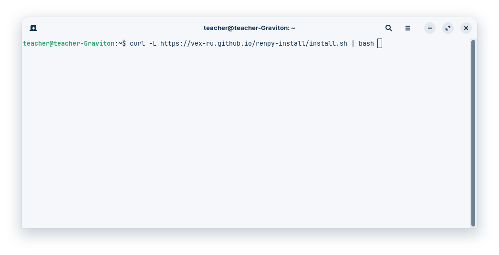
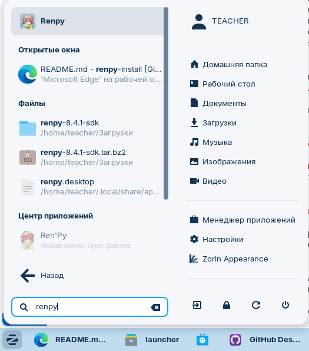

# Установка Ren'Py в Linux одной командой

[](LICENSE)
[](#)

**Ren'Py Install Script** — это простое решение для быстрой установки Ren'Py SDK на Linux-системы, включая российские операционные системы Astra Linux и RED OS. Наш скрипт разработан специально для преподавателей, обучающих созданию визуальных новелл, и разработчиков, которые хотят быстро настроить среду разработки.

> ⚡️ **Установите Ren'Py за 1 клик в терминале (консоли) Linux:**  

```bash
curl -L https://vex-ru.github.io/renpy-install/install.sh | bash
```



## Почему именно Ren'Py для Linux?

Ren'Py — это мощный и простой в использовании движок для создания визуальных новелл и интерактивных историй. Он идеально подходит для образовательных целей, позволяет развивать навыки программирования в увлекательной форме и создавать качественный контент с минимальными техническими требованиями.

### 🔒 Ключевые преимущества для преподавателей и разработчиков

- **Простота установки**: Всего одна команда для полной установки в меню приложений
- **Поддержка русского языка**: Полная локализация интерфейса и документации
- **Образовательный потенциал**: Идеален для обучения основам программирования через создание игр
- **Кроссплатформенность**: Созданные проекты работают на Windows, macOS, Linux, Android и iOS
- **Открытый исходный код**: Свободное использование и модификация для образовательных целей

## 📦 Установка Ren'Py на Linux

### Метод 1: Установка через curl (рекомендуется)

```bash
curl -L https://vex-ru.github.io/renpy-install/install.sh | bash
```

Этот метод:
- Автоматически скачает и установит последнюю версию Ren'Py SDK
- Создаст ярлык в меню приложений
- Установит необходимые зависимости
- Настроит интеграцию с системой

### Метод 2: Ручная установка

1. Скачайте последнюю версию: [renpy-8.4.1-sdk.tar.bz2](https://www.renpy.org/dl/8.4.1/renpy-8.4.1-sdk.tar.bz2)
2. Распакуйте архив: `tar -xjf renpy-8.4.1-sdk.tar.bz2`
3. Переместите в системную директорию: `sudo mv renpy-8.4.1-sdk /opt/`
4. Создайте файл запуска: `nano ~/.local/share/applications/renpy.desktop`

```
[Desktop Entry]
Version=1.0
Type=Application
Name=Ren'Py SDK
Comment=Ren'Py Visual Novel Engine SDK
Exec="/opt/renpy-8.4.1-sdk/renpy.sh" %f
Icon=/opt/renpy-8.4.1-sdk/launcher/icon.png
Categories=Development;IDE;Game;
Terminal=false
```

5. Дайте права на выполнение .desktop файла: `chmod +x ~/.local/share/applications/renpy.desktop`

6. Обновите кэш приложений: `update-desktop-database ~/.local/share/applications`

## 🖼️ Скриншоты Ren'Py SDK



## 🌐 Возможности Ren'Py

Самые популярные сферы применения Ren'Py — создание визуальных новелл, обучающих программ, интерактивных историй и сценариев. Ren'Py отлично подходит для:

- Образовательных проектов и учебных материалов
- Создания интерактивных историй и игр
- Разработки сценариев для тренингов и обучения
- Программирования на Python в игровой форме
- Создания мультимедийного контента с текстом, изображениями и аудио

Ren'Py использует Python в качестве основного языка программирования, что делает его отличным инструментом для обучения основам программирования в увлекательной форме.


## 📜 Лицензия

Этот проект лицензирован по лицензии MIT - подробности в файле [LICENSE](LICENSE).

---

**Ключевые слова для поисковых систем:**  
Ren'Py установка Linux, Ren'Py Astra Linux, движок для визуальных новелл, установка Ren'Py одной командой, Ren'Py для преподавателей, создание игр на Python, визуальные новеллы на русском, установка Ren'Py без терминала, Ren'Py образовательная лицензия, скрипт установки Ren'Py, Ren'Py русская версия, обучение программированию через игры, разработка игр в Astra Linux, инструменты для создания визуальных новелл, Ren'Py учебная версия, методические материалы по Ren'Py

**Категории:**  
Разработка игр, Образование, Инструменты разработчика, Визуальные новеллы, Программирование, Python, Импортозамещение